Ejercicio práctico sobre la utilización básica de Git, GitHub y Markdown 
==================================================

- Alumno: **Juan Isidro**
- Fecha.: 22/05/2016

Repositorio campusciff
==================================================

#### 1. Crear un repositorio en vuestro GitHub llamado *campusciff*.


Desde la web de github voy al desplegable +, opcion new repository. En el formulario pongo el nombre del repositorio y pulso create repository.

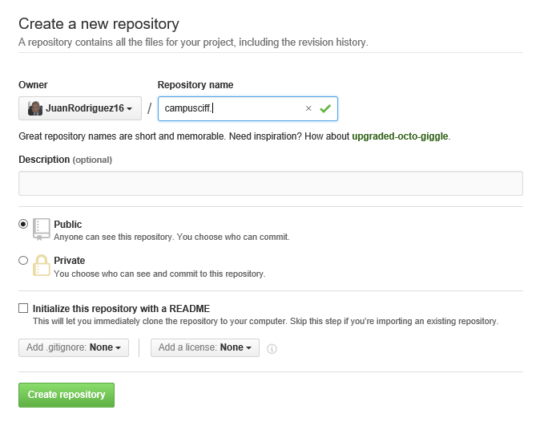

#### 2. Clonar vuestro repositorio en local. 

Para clonar el repositorio ejecutamos el siguiente comando:

```bash
    git clone git@github.com:juanrodriguez16/campusciff.git
```

El resultado en pantalla es el siguiente:

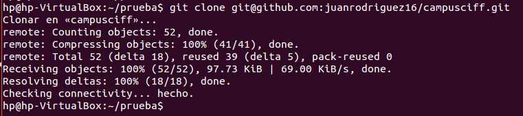


README
==================================================

#### 1. Crear (si no lo habéis creado ya) en vuestro repositorio local un documento README.md. 


```bash
    cd campusciff
	touch > README.md
```

> Notas: en este documento tendreis que ir poniendo los **comandos** que habéis tenido que utilizar durante todos los ejercicios y las **explicaciones y capturas de pantalla** que consideréis **necesarias**.

Commit inicial
==================================================

#### 1. Añadir al README.md los comandos utilizados hasta ahora y hacer un commit inicial con el mensaje commit inicial. 

Primero, editar y modificar el archivo README.md.


```bash
	git add README.md
	git commit -m "Commit inicial"
```

Push inicial
==================================================

#### 1. Subir los cambios al repositorio remoto.


```bash
	git push origin master
```
	
Ignorar archivos
==================================================

#### 1. Crear en el repositorio local un fichero llamado privado.txt.


```bash
	touch privado.txt
```

#### 2. Crear en el repositorio local una carpeta llamada privada. 


	
```bash
	mkdir privada
```

#### 3. Realizar los cambios oportunos para que tanto el archivo como la carpeta sean ignorados por git. 


```bash
	echo "privado.txt" > .gitignore
	echo "privada/*" > .gitignore
```


Añadir fichero 1.txt
==================================================

#### 1. Añadir fichero 1.txt al repositorio local.


```bash
	echo "Añado el fichero 1.txt" > 1.txt
```

Crear el tag v0.1
==================================================

#### 1. Crear un tag v0.1.


```bash
	git tag v0.1
```

Subir el tag v0.1
==================================================

#### 1. Subir los cambios al repositorio remoto.


```bash
    git add 1.txt
    git add .gitignore
    git commit -m "Subiendo fichero 1.txt y .gitignore"
    git push origin master
```

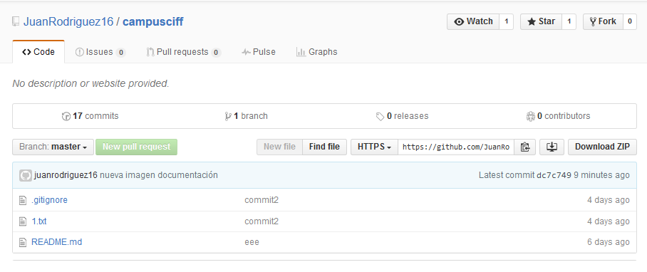

Cuenta de GitHub
==================================================

#### 1. Poner una foto en vuestro perfil de GitHub. 


Seleccion la opción setting desde el menú esquina superior derecha.
Elijo una nueva imagen de mi sistema tras seleccionar la opción Upload new picture, finalmente selecciono update profile para subir la imagen.

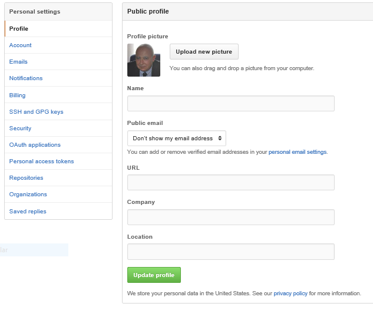

#### 2. Poner el doble factor de autentificación en vuestra cuenta de GitHub.

En el menú desplegable de la esquina superior derecha de la pantalla elegir setting. A continuacion seleccionar security. A continuación set up two factor authentication

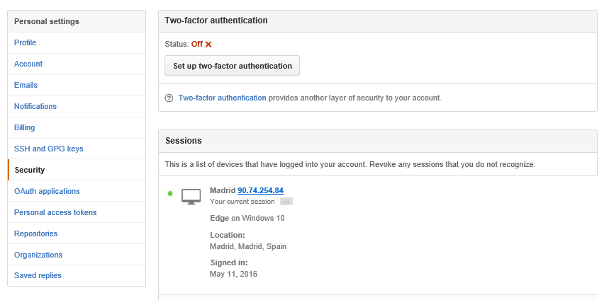

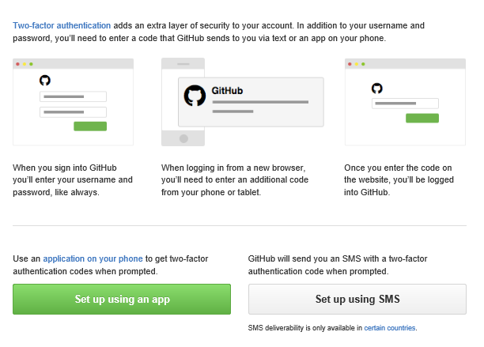

Selecciono una opción. -selecciono set up using sms, e introduzco el codigo que recibo via sms.

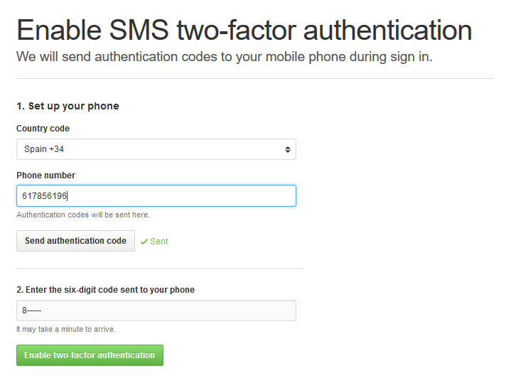

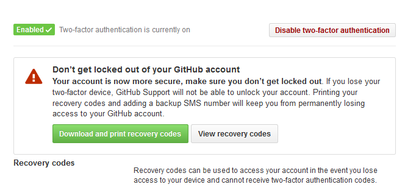

Aqui compruebo que tengo activado el doble factor de autenticación.

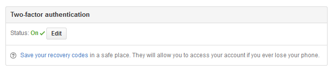


#### 3. Añadir (si no lo habéis hecho ya) la clave pública que se corresponde a tu ordenador. 


```bash
    ls -al ~/.ssh 
    ssh-keygen -t rsa -b 4096 -C "juanrodriguez16@campusciff.net" 
    eval "$(ssh-agent -s)"      
    ssh-add ~/.ssh/id_rsa   
    cat ~/.ssh/id_rsa.pub         
```

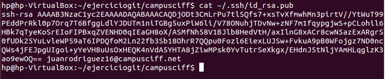


Voy a la pagina SSH and GPG keys elijo la opción New SSH key. 
Se añade el titulo y se pega el contenido (fichero id_rsa.pub). 
Finalmente boton Add SSH Key.

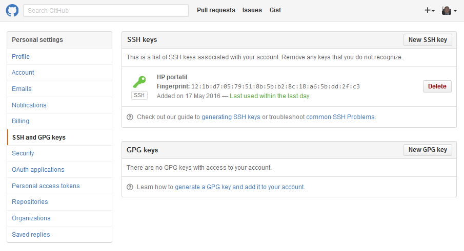

Uso social de GitHub
==================================================

#### 1. Preguntar los nombres de usuario de GitHub de tus compañeros de clase, búscalos, y síguelos. 


1. Desde el menú desplegable de la esquina superior derecha de la pantalla seleccionar la opción "**Explore**".
1. En el cuadro de texto de la parte superior de la nueva pantalla escribir el nombre de usuario de un compañero y pusar la tecla Return. 
1. Aparecerá una nueva pantalla con la lista de elementos de GitHub que corresponden al texto escrito. Pulsar sobre la opción "**Users**" del menú, localizar la persona buscada y pulsar sobre el botón "**Follow**" correspondiente.
1. En la pantalla "Following" pueden verse los compañreros a los que se está siguiendo. 

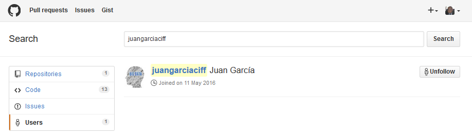

#### 2. Seguir los repositorios campusciff del resto de tus compañeros. 


1. Acceder a la página GitHub de un compañero (Ej.: _https://github.com/eserranom_) y pulsar sobre el nombre del repositorio "**campusciff**".
1. En la pantalla del repositorio pulsar sobre el botón "**Watch**" y seleccionar la opción "**Watching**". 

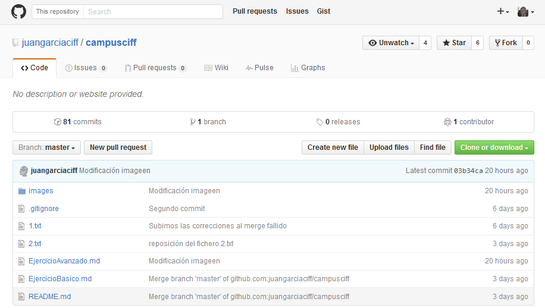

#### 3. Añadir una estrella a los repositorios campusciff del resto de tus compañeros. 


1. Acceder a la página GitHub de un compañero (Ej.: _https://github.com/eserranom_) y pulsar sobre el nombre del repositorio "**campusciff**".
1. En la pantalla del repositorio pulsar sobre el botón "**Star**".

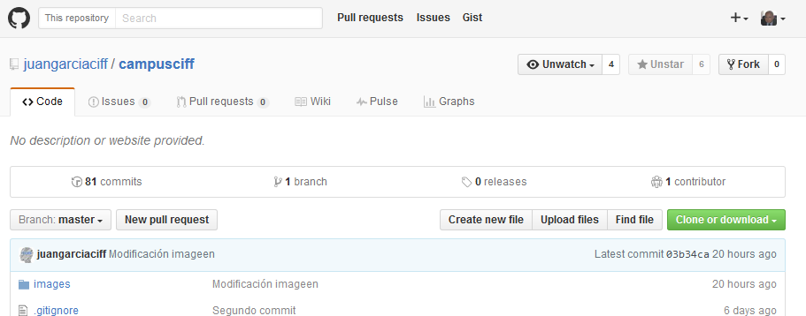

Crear una tabla
==================================================

#### 1. Crear una tabla de este estilo en el fichero README.md con la información de varios de tus compañeros de clase:

| NOMBRE                          | GITHUB            |
| ------------------------------- | ----------------- |
| Ainhoa Calvo                    | [AinhoaCE](https://github.com/AinhoaCE)          |
| Anna Lawrenc                    | [annalawrenc](https://github.com/annalawrenc)       |
| Araceli Macia Barrado           | [araceliMacia](https://github.com/araceliMacia)      |
| Edwin Giovanni Gonzalez Mata    | [giovamata](https://github.com/giovamata)         |
| Enrique Serrano Muñoz           | [eserranom](https://github.com/eserranom)         |
| Fernando Javier Escolano Cuenca | [fescolan](https://github.com/fescolan)          |
| Jorge Maza de Julián            | [jorgemaza](https://github.com/jorgemaza)         |
| Juan Antonio García Cuevas      | [juanrodriguez16](https://github.com/juanrodriguez16)    |
| Mark Wellings                   | [Mark-Wellings](https://github.com/Mark-Wellings)     |
| Asier Matas Hernando            |                   |
| Borja Méndez Mariño             |                   |
| Juan Isidro Rodríguez Granados  |                   |
| Héctor Soto                     |                   |
| José Luis González Blázquez     |                   |
| Alberto Marino                  |                   |
| Sergio Castro Rodriguez         |                   |

Colaboradores
==================================================

#### 1. Poner a github.com/asanzdiego como colaborador del repositorio campusciff


1. Acceder al la página principal del repositorio **campusciff**.
1. Acceder a la pestaña "**Settings**".
1. Acceder a la opción de menú "**Collaborators**".
1. Escribir (o buscar) "**asanzdiego**" en el cuadro de texto "**Search by username, full name or email address**". 
1. Pulsar el botón "**Add collaborator**". 

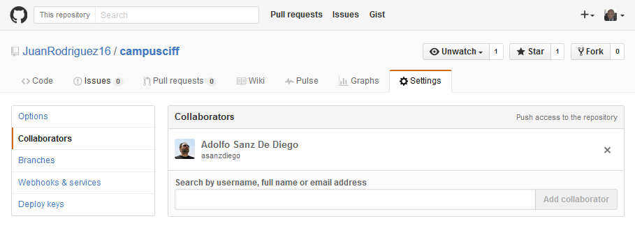

